{width="150"
height="150"}\
\
  --------------------------------------------------
  {width="8" height="1"}Xcode notes
  --------------------------------------------------

  -------------------------------------------------------------------------------------------------------------------------------------------------------------------------------------------------------------------
  Although Raknet is cross-platform, not all of the samples provided will compile/run on Mac OS X or iOS. Here I'll show you how to compile Raknet for Mac OS X and iOS, along with one of the samples for testing\
  \
  -------------------------------------------------------------------------------------------------------------------------------------------------------------------------------------------------------------------

  ---------------------------------------------------------------------------------
  {width="8" height="1"}Compiling as a static library for Mac OS X
  ---------------------------------------------------------------------------------

+--------------------------------------------------------------------------+
| Create an empty workspace                                                |
|                                                                          |
| 1.  Create a folder named *RakNetTests*, and then create a new           |
|     empty Workspace. Name it *RakNetTests*, and save it inside the new   |
|     folder\                                                              |
|     \                                                                    |
|     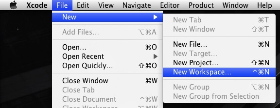\                                         |
|     \                                                                    |
|                                                                          |
| Create the RakNet static library project                                 |
|                                                                          |
| 1.  Using *File-&gt;New-&gt;New Project*, create a new Mac OS X C/C++    |
|     library project\                                                     |
|     \                                                                    |
|     [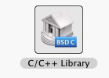](xcode_library.jpg)\                    |
|     \                                                                    |
|     Name it *RakNet* and use the following options:\                     |
|     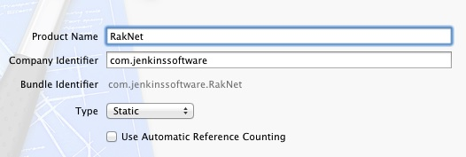\                                          |
|     Save it inside the same folder as the workspace\                     |
|     \                                                                    |
| 2.  Using Finder, copy RakNet's source code (*Source* folder) to where   |
|     RakNet project file was created\                                     |
|     \                                                                    |
|     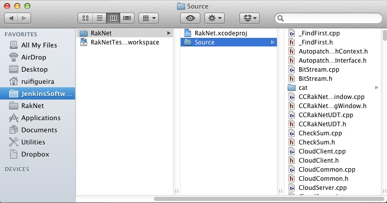\                                         |
|     \                                                                    |
| 3.  Right-click the *RakNet* project, and select *Add Files              |
|     to "RakNet"...* , and select the new *Source* folder you should have |
|     in the same folder as the *RakNet* Project file. Use the following   |
|     options:\                                                            |
|     \                                                                    |
|     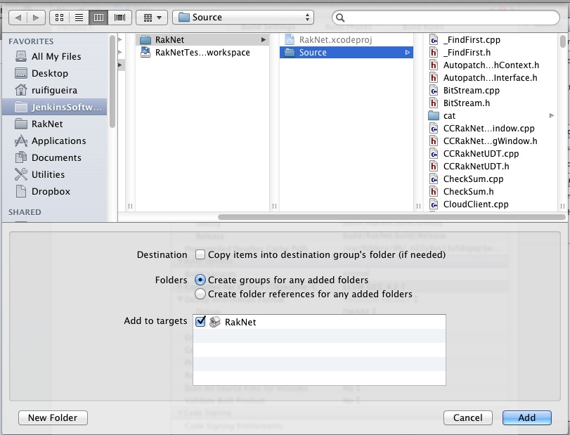\                                             |
|     \                                                                    |
|     This should create a *Source* group, like this:\                     |
|     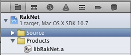\                                    |
|     \                                                                    |
| 4.  The files inside the *cat* folder aren't supposed to be compiled, so |
|     remove the *Source/cat* group from the project files.\               |
|     When prompted for the deletion method, pick ***Remove References     |
|     Only***.\                                                            |
|     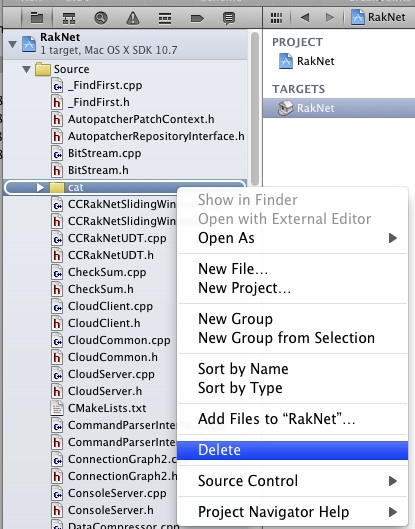\                                           |
|     \                                                                    |
| 5.  Build Raknet using *Product-&gt;Build*\                              |
|     You should get a successful compilation.                             |
+--------------------------------------------------------------------------+

  -----------------------------------------------------------------
  {width="8" height="1"}Testing the static library
  -----------------------------------------------------------------

+--------------------------------------------------------------------------+
| A simple sample...                                                       |
|                                                                          |
| For testing, we're going to use the sample *"Chat Example"* provided     |
| with the Raknet. You can find it the *"Samples/Chat Example"* folder.    |
| This sample has 2 source files, named *"Chat Example Server.cpp"* and    |
| *"Chat Example Client.cpp"*. We are going to create two projects from    |
| those files (one project for the Server, and another for the Client).\   |
| \                                                                        |
| Inside the folder where you have your workspace, create another folder   |
| named *Samples*, and copy *"Chat Example Server.cpp"* and *"Chat Example |
| Client.cpp"* into that folder.\                                          |
| \                                                                        |
| The server                                                               |
|                                                                          |
| 1.  Create a *Command Line Tool* project for the Server:\                |
|     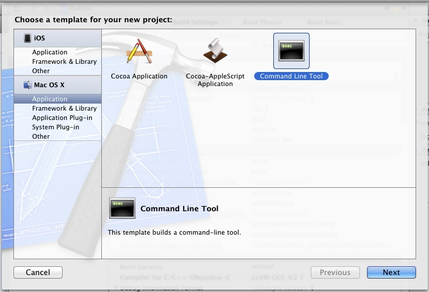\                                   |
|     In the next window where it asks for the options for your new        |
|     project, name it *ChatExampleServer*, leave *Type* as *C++*, and     |
|     *"Use Automatic Reference Counting"* unchecked.\                     |
|     Save the project inside your *Samples* folder.\                      |
|     \                                                                    |
| 2.  Inside the newly created ChatExampleServer, you should have a group  |
|     named *ChatExampleServer*. Delete the *main.cpp* you'll find inside  |
|     that group, and add the *"Chat Example Server.cpp"* file\            |
|     \                                                                    |
| 3.  Specify where to look for the RakNet header files, by changing the   |
|     Build Settings of the ChatExampleServer project. This can be done in |
|     the ***Header Search Paths*** option, under the ***Search Paths***   |
|     section:\                                                            |
|     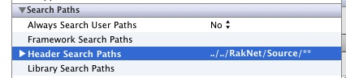\                                    |
|     If your folder structure is exactly the same as the one used for     |
|     this tutorial, then the search path should be what you see in the    |
|     above image. If not then you need to adjust it accordingly.\         |
|     **NOTE:** The search path is relative to the project file's          |
|     location.\                                                           |
|     \                                                                    |
| 4.  Link *ChatExampleServer* project with our RakNet static library, by  |
|     going to ***Build Phases***, section ***Link Binary With             |
|     Libraries***, clicking the **'+'** button and picking our RakNet     |
|     library as shown:\                                                   |
|     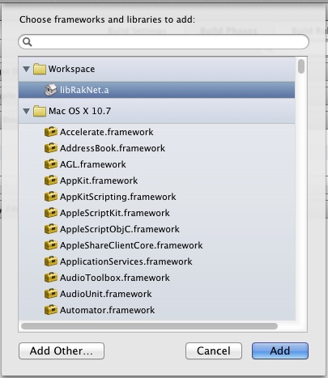\                                      |
|     \                                                                    |
| 5.  You should be able to successfully build and run the Server now.\    |
|                                                                          |
| The Client                                                               |
|                                                                          |
| The steps to create the client project are the same as the ones for the  |
| Server:                                                                  |
| 1.  Create a *"Command Line Tool"* project, and name it                  |
|     *ChatExampleClient*                                                  |
| 2.  Delete the file *main.cpp* and add the file *"Chat Example           |
|     Client.cpp"*                                                         |
| 3.  Change the C/C++ compiler to ***LLVM GCC***                          |
| 4.  Set the header search paths                                          |
| 5.  Add *RakNet* library to the list of libraries to link with.          |
|                                                                          |
| Running the sample                                                       |
|                                                                          |
| You should now have 2 products ready to run (ChatExampleClient and       |
| ChatExampleServer). You can run one of them from inside Xcode, and run   |
| the other externally by right-clicking on it and selecting **"Open With  |
| External Editor"**.                                                      |
+--------------------------------------------------------------------------+

  ----------------------------------------------------------------------------
  {width="8" height="1"}Compiling as a static library for iOS
  ----------------------------------------------------------------------------

\
  ----------------------------------------------------------------------------------------------------------------------------------------------------------------
  Compiling Raknet as a static library for iOS is essentially the same as for Mac OS X.\
  You can create a new project for the iOS library, or you can just create another Target for your Mac OS X static library project, and change what SDK to use:\
  \
  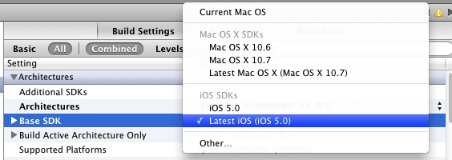\
  \
  You can find some iOS samples in the **Samples/iOS** folder.\
  \
  \
  ----------------------------------------------------------------------------------------------------------------------------------------------------------------

  -----------------------------------------------
  {width="8" height="1"}See Also
  -----------------------------------------------

+--------------------------------------------------------------------------+
| [Index](index.html)\                                                     |
| [3rd party dependencies](dependencies.html)\                             |
| [Introduction](introduction.html)\                                       |
| [System Overview](systemoverview.html)\                                  |
| [Detailed Implementation](detailedimplementation.html)\                  |
| [Tutorial](tutorial.html)\                                               |
| [Preprocessor directives](preprocessordirectives.html)\                  |
+--------------------------------------------------------------------------+

