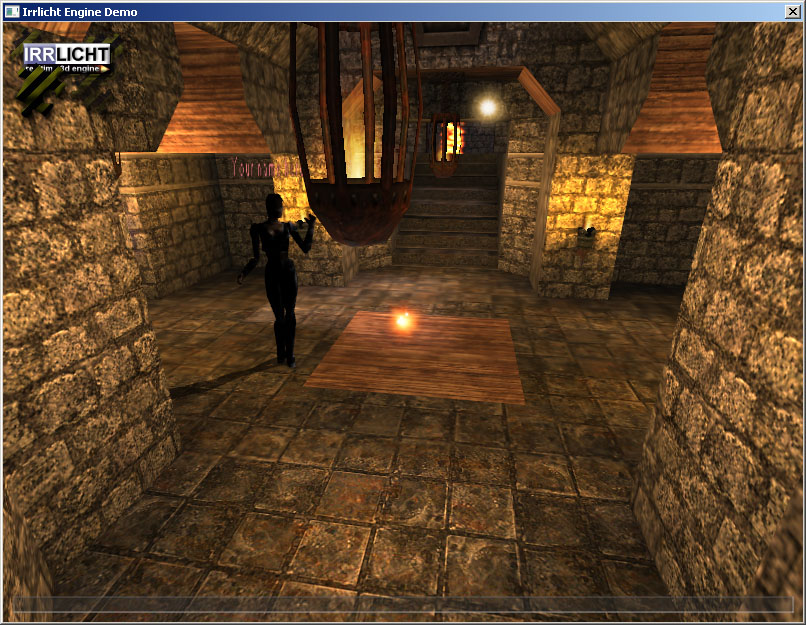

{width="150"
height="150"}\
\
  ---------------------------------
  Optional 3rd party dependencies
  ---------------------------------

+--------------------------------------------------------------------------+
| What follows is a list of projects that will not build without 3rd party |
| dependencies, and where to get these dependencies. These projects are    |
| optional: you can use RakNet without them. Unpack to is where the        |
| project, library, and/or post build step paths are set to by default for |
| the Visual Studio project, and can be changed manually.                  |
|                                                                          |
| ### [IrrlichtDemo](irrlichtfpsdemo.html)                                 |
|                                                                          |
| {width="403" height="312"}                    |
|                                                                          |
| Peer to peer first person shooter demo showing off PHPDirectoryServer,   |
| ReplicaManager3, and NAT punchthrough.                                   |
|                                                                          |
| *Download from*: <http://irrlicht.sourceforge.net/downloads.html>        |
|                                                                          |
| *Unpack to*: C:\\irrlicht-1.7.2\\include                                 |
|                                                                          |
|                                                                          |
|                                                                          |
| ### [Ogre3DInterpDemo](ogre3dinterpdemo.html)                            |
|                                                                          |
| Client/Server ReplicaManager3 and interpolation demo                     |
| *Download from*: http://www.ogre3d.org/download                          |
|                                                                          |
| *Unpack to*: Doesn't matter, Uses enviroment variable \$(OGRE\_HOME)     |
|                                                                          |
| *Last checked against*: Prebuilt binary 1.7.4. OGRE\_HOME set to         |
| C:\\OgreSDK\_vc9\_v1-7-4.                                                |
|                                                                          |
|                                                                          |
|                                                                          |
| ### [AutopatcherMySQLRepository](autopatcher.html)                       |
|                                                                          |
| One of two supported database backends for the AutopatcherServer         |
| project, which is required to use AutopatcherClient. You only need one   |
| of the two.                                                              |
| *Download from*: http://dev.mysql.com/downloads/                         |
|                                                                          |
| *Unpack to*: C:\\Program Files (x86)\\MySQL\\MySQL Server 5.1            |
|                                                                          |
| Note: MySQL is an order of magnitude slower than PostgreSQL with         |
| AutopatcherServer.                                                       |
|                                                                          |
|                                                                          |
|                                                                          |
| ### [AutopatcherPostgreSQLRepository](autopatcher.html)                  |
|                                                                          |
| One of two supported database backends for the AutopatcherServer         |
| project, which is required to use AutopatcherClient. You only need one   |
| of the two. During installation be sure to check developer tools, or the |
| header files will not be installed.                                      |
| *Download from*: http://www.postgresql.org/download/                     |
|                                                                          |
| *Unpack to*: C:\\Program Files (x86)\\PostgreSQL\\9.1                    |
|                                                                          |
|                                                                          |
|                                                                          |
| **SQLite\\Logger\\D3D9Samples\\Matrices**                                |
|                                                                          |
| This is a demo that assumes the DirectX SDK is installed. Get it from    |
| <http://www.microsoft.com> . You will also need to setup the Visual      |
| Studio global library and include paths.                                 |
|                                                                          |
|                                                                          |
|                                                                          |
| ### [Lobby2Server\_PGSQL](lobby.html)                                    |
|                                                                          |
| Database backend for the Lobby2 system, supporting users, clans,         |
| friends, and other persistent information.                               |
| *Download from*: http://www.postgresql.org/download/                     |
|                                                                          |
| *Unpack to*: C:\\Program Files (x86)\\PostgreSQL\\8.3                    |
|                                                                          |
|                                                                          |
|                                                                          |
| **RoomsAndLobbyGFx3**                                                    |
|                                                                          |
| Visual front-end for the RoomsPlugin and Lobby2 systems, with the        |
| ability to login and display a list of rooms. Note: Scaleform requires   |
| registration and is not-free.                                            |
|                                                                          |
| *Download from*: http://www.scaleform.com/                               |
|                                                                          |
| *Unpack to*: Doesn't matter, uses enviroment variable \$(GFXSDK)         |
|                                                                          |
|                                                                          |
|                                                                          |
| ### [AutopatcherClientGFx3](autopatcher.html)                            |
|                                                                          |
| Visual front-end for the AutopatcherClient system. Note: Scaleform       |
| requires registration and is non-free.                                   |
| *Download from*: http://www.scaleform.com/                               |
|                                                                          |
| *Unpack to*: Doesn't matter, uses enviroment variable \$(GFXSDK)         |
|                                                                          |
|                                                                          |
|                                                                          |
| ### [RakVoiceDSound](rakvoice.html)                                      |
|                                                                          |
| One of three sound implementations of RakVoice, supporting DirectSound,  |
| FMOD, and PortAudio. PortAudio is already included in the RakVoice       |
| project. Unless you intend to use DirectSound, you do not need this      |
| project.                                                                 |
| *Download from*: http://msdn.microsoft.com/en-us/directx/aa937788.aspx   |
|                                                                          |
| *Unpack to*: Doesn't matter, uses enviroment variable \$(DXSDK\_DIR)     |
|                                                                          |
|                                                                          |
|                                                                          |
| ### [RakVoiceFMOD](rakvoice.html)                                        |
|                                                                          |
| One of three sound implementations of RakVoice, supporting DirectSound,  |
| FMOD, and PortAudio. PortAudio is already included in the RakVoice       |
| project. Unless you intend to use FMOD, you do not need this project.    |
| Note: FMOD is not necessarily free.                                      |
| *Download from*: http://www.fmod.org/index.php/download                  |
|                                                                          |
| *Unpack to*: C:\\Program Files\\FMOD SoundSystem                         |
|                                                                          |
| *Last checked against*: Fmod 4.38.07                                     |
|                                                                          |
|                                                                          |
|                                                                          |
| ### [RPC3](RPC3Video.htm)                                                |
|                                                                          |
| Remote procedure calls using C++ and semi-automatic serialization.       |
| Includes support for networked [signals and                              |
| slots](http://en.wikipedia.org/wiki/Signals_and_slots). Note: The        |
| majority of boost is not required, only those files actually used by     |
| RPC3. If you don't want to use Boost, you can use the RPC4 plugin        |
| instead which has similar functionality to the RPC found in RakNet       |
| version 3.                                                               |
| *Download from*: http://www.boost.org/users/download/                    |
|                                                                          |
| *Unpack to*: c:/boost\_1\_48\_0                                          |
|                                                                          |
| Note: You can use RPC4 if you do not want to install Boost, it however   |
| cannot call directly into C++ member functions or automatically          |
| serialize method parameters.                                             |
|                                                                          |
|                                                                          |
|                                                                          |
|                                                                          |
|                                                                          |
|                                                                          |
|                                                                          |
|                                                                          |
+--------------------------------------------------------------------------+

  ----------
  See Also
  ----------

  ----------------------
  [Index](index.html)\
  [FAQ](faq.html)\
  ----------------------

