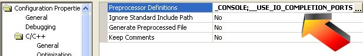

\
\
  ----------------------------------------------------------------------------------------------
  {width="8" height="1"}IO Completion ports \[Currently Disabled - Do not use\]
  ----------------------------------------------------------------------------------------------

+--------------------------------------------------------------------------+
| IO completion ports overview\                                            |
| \                                                                        |
| **IO Completion ports require Windows NT 3.5, 2000, or XP!**\            |
| \                                                                        |
| IO Completion ports is a method Windows uses to notify and awaken a      |
| thread when asynchronous IO is complete. This is more efficient than     |
| creating one thread per IO operation and having that thread wait for the |
| operation to complete. Instead, a pool of threads is created (in this    |
| case two threads per processor). These pool of threads block on the IO   |
| completion port and when an IO operation is complete one thread wakes up |
| and performs another operation. This will benefit servers with hundreds  |
| to thousands of players. It does not benefit games with only a few       |
| players and in fact may be slower due to Windows overhead.\              |
| \                                                                        |
| RakNet pools the IO completion port worker threads. Therefore, multiple  |
| instances of servers and clients on one computer will all share the      |
| worker threads. This improves efficiency in cases such as running        |
| multiple servers on one machine, or a client and a server on the same    |
| machine.                                                                 |
| Enabling IO completion ports\                                            |
| \                                                                        |
| To enable IO completion ports, declare the preprocessor define           |
| **\_\_USE\_IO\_COMPLETION\_PORTS** and rebuild all. To not enable IO     |
| completion ports, simply do not define this. Note that the included      |
| pre-build DLLs do not use IO completion ports to ensure Windows          |
| compatibility. You can however easily build your own by loading the      |
| sample project found at \\Samples\\Project                               |
| Samples\\CreateDLLSampleProject , defining                               |
| \_\_USE\_IO\_COMPLETION\_PORTS, and building.\                           |
| \                                                                        |
|                                                                          |
|   -----------------------------------------------------------------      |
|   \        |
|   **Defining \_\_USE\_IO\_COMPLETION\_PORTS in .net 2003**               |
|   -----------------------------------------------------------------      |
+--------------------------------------------------------------------------+

  -----------------------------------------------
  {width="8" height="1"}See Also
  -----------------------------------------------

  ----------------------
  [Index](index.html)\
  ----------------------

