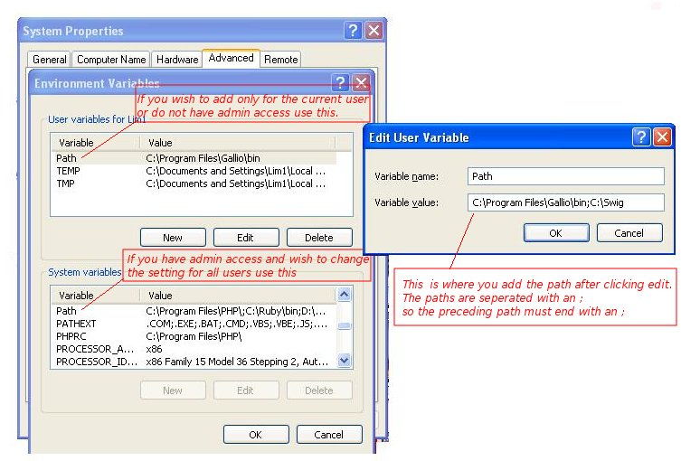
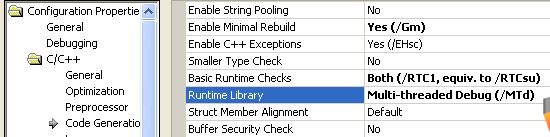
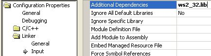
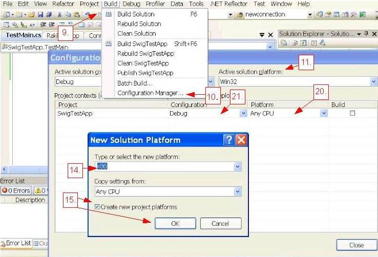

{width="150"
height="150"}\
\
\
  -----------------------------------------------
  {width="8" height="1"}Overview
  -----------------------------------------------

+--------------------------------------------------------------------------+
| What is Swig?\                     |
| \                                                                        |
| Swig is an application that generates wrapper code for a native DLL to   |
| interface with other languages allowing you to use a C/C++ library in    |
| one of the supported languages. Currently Swig configuration for RakNet  |
| is set up to generate a managed interface that can be used in managed    |
| C\# in Windows, as well as in Linux with Mono.\                          |
| \                                                                        |
| Swig generates a CXX and .h file, which exposes interfaces that can be   |
| used by the target language. The CXX file is included when building the  |
| C++ dll that the target language  uses.\                                 |
| \                                                                        |
| Swig also generates files in the target language for inclusion in the    |
| project of the target language to interface with the dll. These are      |
| added to the project of the target language.\                            |
| \                                                                        |
| What is Mono?\                            |
| \                                                                        |
| Mono is a cross platform implementation of the .Net framework.    |
| This allows you to compile C\# and other .Net code and run them on       |
| platforms that originally are not .Net compatible like Linux.\           |
| \                                                                        |
| Choices to Make.\                         |
| \                                                                        |
| You may choose to use the tools with RakNet or start from         |
| scratch.\                                                                |
| \                                                                        |
| On Windows batch tools are provided make the process easier. These tools |
| are located under the Swig Directory under DependentExtensions. For      |
| Linux the tools will use Wget to pull down Swig and install version      |
| 2.0.00 if Swig is not installed.\                                        |
| \                                                                        |
| You may also download Swig yourself and compile them by specifying the   |
| options manually. In the manual portion the options used will be         |
| explained.\                                                              |
| \                                                                        |
| Step Summary\                             |
| \                                                                        |
| Manually:\                       |
|                                                                   |
| 1.  Download Swig, see "Downloading Swig"                                |
| 2.  Generate the Swig files, see "Generating the Swig Files Manually"    |
| 3.  Create the DLL, see "Creating the Swig Wrapped DLL Project"          |
| 4.  Create the C\# project. see  "Creating the C\# project"              |
|                                                                          |
| Using tools:\                           |
| \                                                                        |
| \*Windows\                                                               |
| \                                                                        |
| -Using DLL\_Swig\\RakNet.sln solution\                                   |
|                                                                   |
| 1.  Download Swig, see section "Downloading Swig"                        |
| 2.  If you do not plan on using SQLiteClientLoggerPlugin,                |
|     DependentExtensions\\Swig\\DLL\_Swig\\RakNet.sln already contains a  |
|     DLL project that makes the Swig files, builds the DLL, and copies it |
|     to the C\# sample. Perform a rebuild on this.                        |
| 3.  Create the C\# project see  "Creating the C\# project"               |
|                                                                          |
| -Not using DLL\_Swig                    |
| project\                         |
|                                                                   |
| 1.  Download Swig, See section "Downloading Swig"                        |
| 2.  Generate the Swig files, see "Generating the Swig Files Using        |
|     Included Tools"                                                      |
| 3.  Create the DLL, see "Creating the Swig Wrapped DLL Project"          |
| 4.  Create the C\# project see  "Creating the C\# project"               |
|                                                                          |
| \                                                                        |
| \*Linux\                                |
|                                                                   |
| 1.  Download Swig, See section "Downloading Swig".                       |
| 2.  Generate the Swig files, see "Generating the Swig Files Using        |
|     Included tools"                                                      |
| 3.  Create the C\# project see  "Creating the C\# project"               |
|                                                                          |
|                                    |
+--------------------------------------------------------------------------+

  -------------------------------------------------------
  {width="8" height="1"}Downloading Swig
  -------------------------------------------------------

+--------------------------------------------------------------------------+
| Windows\                                  |
| \                                                                        |
| Download Swig and Unzip.\                                                |
| \                                                                        |
|                                                                   |
| 1.  Go to <http://www.swig.org/>                                         |
| 2.  On the left hand side click                                          |
|     [Download](http://www.swig.org/survey.html).                         |
| 3.  Either fill out the survey or click the [Download                    |
|     area](http://www.swig.org/download.html) link.                       |
| 4.  It will say Windows users should download &lt;link&gt; click on      |
|     the link.                                                            |
| 5.  Unzip to C:\\Swig or where you prefer C:\\Swig will be used for      |
|     this tutorial.                                                       |
| 6.  If you wish to use the DLL\_Swig project you will need to add to the |
|     path variable as shown below.                                        |
|                                                                          |
|  Adding Swig to the Path Variable.\       |
| \                                                                        |
|                                                                   |
| 1.  Right click My Computer and click Properties.                        |
| 2.  Click on the Advanced tab.                                           |
| 3.  Under Advanced, there is an Environment Variables button click it.   |
| 4.  Click the on the Path variable                                       |
| 5.  Click the Edit button                                                |
| 6.  Add the path C:\\Swig or wherever you unzipped Swig to.\             |
|                                                                          |
|   ------------------------------------------------------------------     |
|   \                     |
|   The path variable screen       |
|   ------------------------------------------------------------------     |
|                                                                          |
| Linux\                             |
| \                                                                        |
| Download Swig,Unzip,Make, and Install.\   |
| \                                                                        |
| Note: You may be able to install Swig |
| using your favorite package manager, if you can go that route do so. The |
| instructions vary depending on your package manager and distribution.    |
| The batch file will attempt to install 1.6, but it is recommended to use |
| the package manager if you are able to.                    |
| 1.  Go to <http://www.swig.org/>                                         |
| 2.  On the left hand side click                                          |
|     [Download](http://www.swig.org/survey.html).                         |
| 3.  Either fill out the survey or click the [Download                    |
|     area](http://www.swig.org/download.html) link.                       |
| 4.  It will say latest development release is &lt;link&gt; click on      |
|     the link.                                                            |
| 5.  Open a terminal                                                      |
| 6.  Change to the directory you download swig into                       |
| 7.  type tar xzf swig-VERSIONNUMBER.tar.gz and  hit enter\               |
| 8.  type cd VERSIONNUMBER and  hit enter                                 |
| 9.  type ./configure and  hit enter                                      |
| 10. type make and  hit enter                                             |
| 11. switch to your root user, or if user is a sudo user skip to next     |
|     step                                                                 |
| 12. if root type make install and hit enter, other wise type sudo make   |
|     install and hit enter if user is a sudo user.\                       |
+--------------------------------------------------------------------------+

  -------------------------------------------------
   Generating the Swig Files Using Included Tools
  -------------------------------------------------

+--------------------------------------------------------------------------+
| Generating the Swig Files Using Included  |
| Tools on Windows.\                                                       |
| \                                                                        |
| Note: This step on Windows can be skipped if you are using the    |
| included DLL\_Swig project as it runs the tools on rebuild.\             |
| 1.  Click the start menu and click on run. In Vista click                |
|     start-&gt;search type "run" hit enter.                               |
| 2.  Type cmd and hit enter.                                              |
| 3.  In the next command PATH\_TO\_RAKNET\_SWIG\_FILES is the path to the |
|     swig directory. For example C:\\RakNet\\DependentExtensions\\Swig    |
| 4.  Type cd PATH\_TO\_RAKNET\_SWIG\_FILES hit enter                      |
| 5.  In the next command PATH\_TO\_RAKNETSOURCE is the path to the swig   |
|     source directory. For example: C:\\RakNet\\Source. PATH\_TO\_SWIG is |
|     an unquoted path with a trailing slash to the Swig directory         |
|     Example: C:\\Swig\\. If you added swig to your path variable         |
|     then PATH\_TO\_SWIG is not needed and can be ignored.                |
| 6.  Enter MakeSwig.bat PATH\_TO\_RAKNETSOURCE PATH\_TO\_SWIG. For        |
|     example, MakeSwig.bat c:\\RakNet\\Source c:\\swigwin-2.0.9\          |
| 7.  If you want to use SQLiteClientLoggerPlugin skip \#6, the next steps |
|     will be used instead.                                                |
| 8.  If you have added swig to your path variable, just use "" for        |
|     PATH\_TO\_SWIG                                                       |
| 9.  PATH\_TO\_SQLITEPLUGIN is the path to the SQLite plugin directory.   |
|     EX: C:\\RakNet\\DependentExtensions\\SQLite3Plugin                   |
| 10. Type MakeSwig.bat PATH\_TO\_RAKNETSOURCE PATH\_TO\_SWIG              |
|      PATH\_TO\_SQLITEPLUGIN hit enter                                    |
| 11. Goto "Creating the Swig Wrapped DLL Project"                         |
|                                                                          |
| Generating the Swig Files Using Included  |
| Tools on Linux.\                                                         |
| \                                                                        |
| Note: The Linux batch requires Wget,Tar,Make and GCC  to be    |
| installed, unless swig is already installed. Most of the time            |
| Wget,Tar,Make and GCC                       |
| are already installed.\                 |
|                                                                   |
| 1.  Open a terminal if you are not already at one.\                      |
| 2.  In the next command PATH\_TO\_RAKNET\_SWIG\_FILES is the path to the |
|     swig directory. For example                                          |
|     /home/usr/RakNet/DependentExtensions/Swig                            |
| 3.  Type cd PATH\_TO\_RAKNET\_SWIG\_FILES hit enter                      |
| 4.  Type chmod u+x MakeSwig.sh\                                          |
| 5.  In the next command PATH\_TO\_RAKNETSOURCE is the path to the swig   |
|     source directory. For example: /home/usr/RakNet/Source               |
| 6.  Type ./MakeSwig.sh PATH\_TO\_RAKNETSOURCE hit enter                  |
| 7.  If you want to use SQLiteClientLoggerPlugin skip \#6, the next steps |
|     will be used instead.\                                               |
| 8.  PATH\_TO\_SQLITEPLUGIN is the path to the SQLite plugin directory.   |
|     EX: /home/usr/RakNet/DependentExtensions/SQLite3Plugin\              |
| 9.  Type MakeSwig.sh PATH\_TO\_RAKNETSOURCE PATH\_TO\_SQLITEPLUGIN hit   |
|     enter\                                                               |
| 10. Skip to "Creating the C\# project".                                  |
+--------------------------------------------------------------------------+

  -------------------------------------
   Generating the Swig Files Manually
  -------------------------------------

+--------------------------------------------------------------------------+
| Windows\                                  |
| \                                  |
|  Generate the Swig Files\   |
| 1.  Click the start menu and click on run. In Vista click                |
|     start-&gt;search type "run" hit enter.                               |
| 2.  Type cmd and hit enter.                                              |
| 3.  In the next command PATH\_TO\_RAKNET\_SWIG\_FILES is the path to the |
|     swig directory. For example C:\\RakNet\\DependentExtensions\\Swig    |
| 4.  Type cd PATH\_TO\_RAKNET\_SWIG\_FILES hit enter                      |
| 5.  In the next command PATH\_TO\_RAKNETSOURCE is the path to the swig   |
|     source directory. For example: C:\\RakNet\\Source                    |
| 6.  Type C:\\Swig\\swig -c++ -csharp -namespace RakNet                   |
|     -I"PATH\_TO\_RAKNETSOURCE" -I"SwigInterfaceFiles" -outdir            |
|     SwigOutput\\SwigCSharpOutput -o                                      |
|     SwigOutput\\CplusDLLIncludes\\RakNet\_wrap.cxx                       |
|     SwigInterfaceFiles\\RakNet.i hit enter                               |
| 7.  If you want to use SQLiteClientLoggerPlugin skip \#6                 |
| 8.  PATH\_TO\_SQLITEPLUGIN is the path to the SQLite plugin directory.   |
|     EX: C:\\RakNet\\DependentExtensions\\SQLite3Plugin                   |
| 9.  Type C:\\Swig\\swig -c++ -csharp -namespace RakNet                   |
|     -I"PATH\_TO\_RAKNETSOURCE" -I"SwigInterfaceFiles"                    |
|     -I"PATH\_TO\_SQLITEPLUGIN" -DSWIG\_ADDITIONAL\_SQL\_LITE -outdir     |
|     SwigOutput\\SwigCSharpOutput -o                                      |
|     SwigOutput\\CplusDLLIncludes\\RakNet\_wrap.cxx                       |
|     SwigInterfaceFiles\\RakNet.i hit enter                               |
|                                                                          |
| Linux\                             |
| \                                         |
|  Generate the Swig Files\   |
| 1.  Open a terminal\                                                     |
| 2.  In the next command PATH\_TO\_RAKNET\_SWIG\_FILES is the path to the |
|     swig directory. For example                                          |
|     /home/usr/RakNet/DependentExtensions/Swig                            |
| 3.  Type cd PATH\_TO\_RAKNET\_SWIG\_FILES hit enter                      |
| 4.  In the next command PATH\_TO\_RAKNETSOURCE is the path to the swig   |
|     source directory. For example: /home/usr/RakNet/Source               |
| 5.  Type swig -c++ -csharp -namespace RakNet -I"PATH\_TO\_RAKNETSOURCE"  |
|     -I"SwigInterfaceFiles" -outdir SwigOutput/SwigCSharpOutput -o        |
|     SwigOutput/CplusDLLIncludes/RakNet\_wrap.cxx                         |
|     SwigInterfaceFiles/RakNet.i and hit enter                            |
| 6.  f you want to use SQLiteClientLoggerPlugin skip \#6                  |
| 7.  PATH\_TO\_SQLITEPLUGIN is the path to the SQLite plugin directory.   |
|     EX: /home/usr/RakNet/DependentExtensions/SQLite3Plugin               |
| 8.  Type swig -c++ -csharp -namespace RakNet -I"PATH\_TO\_RAKNETSOURCE"  |
|     -I"SwigInterfaceFiles" -I"PATH\_TO\_SQLITEPLUGIN"                    |
|     -DSWIG\_ADDITIONAL\_SQL\_LITE -outdir SwigOutput/SwigCSharpOutput -o |
|     SwigOutput/CplusDLLIncludes/RakNet\_wrap.cxx                         |
|     SwigInterfaceFiles/RakNet.i and hit enter                            |
|                                                                          |
| Swig Options Explained\                   |
| \                                                                        |
| -c++ \                    |
| \                                                                        |
| This must come first. This means that the source files are C++ not C.\   |
| \                                                                        |
| -csharp \                        |
| \                                       |
| This is the target language. Currently the files are made for C\# |
| and may not work with the other options.\                                |
| \                                                                        |
| -namespace RakNet\               |
| \                                       |
| This puts the generated files in the C\# namespace RakNet\        |
| \                                       |
| -I"PATH\_TO\_RAKNETSOURCE" \                                      |
| \                                                                        |
| This option includes the directory for any source and includes if        |
| different from the interface file location.\                             |
| \                                                                        |
| -I"SwigInterfaceFiles" \         |
| \                                                                        |
| This option includes the directory for the interface files.\             |
| \                                                                        |
| -outdir SwigOutput/SwigCSharpOutput     |
| \                                                                 |
| \                                                                        |
| This is where the output files to be included in the target language are |
| placed.\                                                                 |
| \                                                                        |
| -o                                      |
| SwigOutput/CplusDLLIncludes/RakNet\_wrap.cxx\                     |
| \                                         |
| This is where the file that is included in the DLL project is     |
| placed.\                                                                 |
| \                                                                        |
| \*The below two are used if             |
| SQLiteClientLoggerPlugin is used:\                                |
| \                                                                        |
| -I"PATH\_TO\_SQLITEPLUGIN"\             |
| \                                                                        |
| Another include directory, the base directory where the SQLite    |
| plugin is.\                                                              |
| \                                                                        |
| -DSWIG\_ADDITIONAL\_SQL\_LITE\          |
| \                                                                        |
| A conditional compilation symbol, defined to include              |
| SQLiteClientLoggerPlugin.\              |
| \                                  |
|                                                                   |
+--------------------------------------------------------------------------+

  ----------------------------------------------------------------------------
  {width="8" height="1"}Creating the Swig Wrapped DLL Project
  ----------------------------------------------------------------------------

+--------------------------------------------------------------------------+
| Windows                            |
|                                                                          |
| \                                       |
| Note: If you do not plan on using SQLiteClientLoggerPlugin,       |
| DependentExtensions\\Swig\\DLL\_Swig\\RakNet.sln already contains a DLL  |
| project that makes the Swig files, builds the DLL, and copies it to the  |
| C\# sample. You do not need to run these steps if you use that project.  |
| In that case, run the solution, rebuild the project, and goto "Creating  |
| the C\# project"\                       |
|                                                                   |
| Creating the Swig  DLL                                                   |
|                                                                          |
| 1.  Create a DLL project. I'll assume you know how to do this. In MSVC 7 |
|     you would create an empty project, then under Application Settings   |
|     you check DLL and empty project.                                     |
| 2.  Add the source files under the /Source directory to the project.     |
| 3.  Add RakNet.cxx                        |
|     from Swigtools/CplusDLLIncludes                               |
| 4.  Add to the project these files under DependentExtensions:            |
|     SQLite3Plugin\\SQLite3ClientPlugin.h,                                |
|     SQLite3Plugin\\SQLite3PLuginCommon.h,                                |
|     SQLite3Plugin\\Logger\\ClientOnly\\SQLiteClientLoggerPlugin.h,       |
|     SQLite3Plugin\\Logger\\SQLliteLoggerCommon.h,                        |
|     SQLite3Plugin\\SQLite3ClientPlugin.cpp,                              |
|     SQLite3Plugin\\SQLite3PLuginCommon.cpp,                              |
|     SQLite3Plugin\\Logger\\ClientOnly\\SQLiteClientLoggerPlugin.cpp,     |
|     SQLite3Plugin\\Logger\\SQLliteLoggerCommon.cpp                       |
| 5.  Add to "Additional Include Directories" the path to these folders in |
|     the DependentExtensions directory:                                   |
|     SQLite3Plugin\\Logger\\ClientOnly, SQLite3Plugin\\Logger,            |
|     SQLite3Plugin                                                        |
| 6.  Add to "Additional Include Directories" your directory with the      |
|     source files.                                                        |
| 7.  Import ws2\_32.lib, or wsock32.lib if you don't have Winsock         |
|     2 installed. In MSVC 7 you can right click on the project, select    |
|     configuration properties / linker / input / additional dependencies  |
|     and type "ws2\_32.lib" in there.                                     |
| 8.  Set your project to use multi-threaded runtime libraries. In MSVC 7  |
|     you can right click on the project, select configuration properties  |
|     / C/C++ / Code Generation / Runtime Library and change it to         |
|     Multi-threaded (/MT).                                                |
| 9.  Add \_RAKNET\_DLL to the Preprocessor Definitions. In VS Project     |
|     Properties -&gt; Configuration Properties -&gt; C/C++ -&gt;          |
|     PreProcessor -&gt; Preprocessor Definitions                          |
| 10. Set the character set to "not set".In VS Project Properties -&gt;    |
|     Configuration Properties -&gt; General-&gt; Character Set            |
| 11. Optionally set your                                                  |
|     [preprocessor directives.](preprocessordirectives.html)              |
| 12. Then hit F7 or the equivalent to build your DLL and Lib.             |
|                                                                          |
|   ------------------------------------------------                       |
|   \                                  |
|   **Creating an empty DLL project in .net 2003**                         |
|   ------------------------------------------------                       |
|                                                                          |
|   -------------------------------------------------------------          |
|   \            |
|   **Setting Multithreaded debug in .net 2003**                           |
|   -------------------------------------------------------------          |
|                                                                          |
|   ---------------------------------------------------                    |
|   \                      |
|   **Including ws2\_32.lib in .net 2003**                                 |
|   ---------------------------------------------------                    |
|                                                                          |
| \                                                                        |
| Linux                              |
|                                                                          |
| Creating the Swig  Dynamic Link                                          |
|                                                                          |
| Note: If you ran the linux batch tool |
| it will have made the dynamic link and attempted to install it, so you   |
| may skip these steps if it ran successfully.\                     |
|                                                                          |
| 1.  In the next command PATH\_TO\_RAKNET\_SWIG\_FILES is the path to the |
|     swig directory.   |
|     EX:: ../DependentExtensions/Swig< |
| /span>                                                                   |
| 2.  g++                                                                  |
|     \*.cpp PATH\_TO\_RAKNET\_SWIG\_FILES/SwigOutput/CplusDLLIncludes/Rak |
| Net\_wrap.cxx                                                            |
|     -l pthread -I./ -shared -o RakNet                                    |
| 3.  Note: In the previous command -l pthread is lower case L while -I./  |
|     is uppercase i.                                                      |
| 4.  If you wish to use SQLiteClientLoggerPlugin in the place of \#2 use  |
|     the below instructions                                               |
| 5.   PATH\_TO\_SQLITEPLUGIN is the path to the SQLite plugin directory.  |
|     EX: /home/usr/RakNet/DependentExtensions/SQLite3Plugin               |
| 6.  g++                                                                  |
|     \*.cpp PATH\_TO\_RAKNET\_SWIG\_FILES/SwigOutput/CplusDLLIncludes/Rak |
| Net\_wrap.cxx                                                            |
|     PATH\_TO\_SQLITEPLUGIN\\SQLite3ClientPlugin.cpp                      |
|     PATH\_TO\_SQLITEPLUGIN \\SQLite3PLuginCommon.cpp                     |
|     PATH\_TO\_SQLITEPLUGIN                                               |
|     \\Logger\\ClientOnly\\SQLiteClientLoggerPlugin.cpp                   |
|     PATH\_TO\_SQLITEPLUGIN \\Logger\\SQLliteLoggerCommon.cpp  -l pthread |
|     -I./ -IPATH\_TO\_SQLITEPLUGIN\\Logger\\ClientOnly -IPATH\_TO\_SQLITE |
| PLUGIN\\Logger -IPATH\_TO\_SQLITEPLUGIN                                  |
|     -shared -o RakNet                                                    |
| 7.  A file called RakNet should be created that will be copied in the    |
|     next section\                                                        |
|                                                                          |
| \                                                                        |
+--------------------------------------------------------------------------+

  ---------------------------------------------------------------
  {width="8" height="1"}Creating the C\# project
  ---------------------------------------------------------------

+--------------------------------------------------------------------------+
| Windows\                                  |
| \                                                                        |
| C\# Project Setup\                 |
|                                                                   |
| 1.  Create a new C\# project. In the included sample a console project   |
|     is used.                                                             |
| 2.  If you wish to keep the project cleaner create a new folder          |
|     called Swig. Right click the project and go to Add -&gt; New folder  |
| 3.  Add the source files that were generated under                       |
|     the SwigOutput\\SwigCSharpOutput directory to the project.The first  |
|     step to doing this is right clicking the project, or if you added a  |
|     folder right click the folder.                                       |
| 4.  Go to Add -&gt; Existing Item.                                       |
| 5.  Browse to the SwigOutput\\SwigCSharpOutput directory.                |
| 6.   If you want to link to the files rather than create a copy click on |
|     the arrow next to add and add a link. Otherwise click add.           |
| 7.  Copy the DLL created in the previous step to the same folder as      |
|     the binary. Example: bin\\Debug                                      |
| 8.  If you wish the project to be compatible with 64 bit vista you need  |
|     to use the following steps.                                          |
| 9.  When the project is opnen there should be a menu item called Build.  |
|     Click it.                                                            |
| 10. Go to Configuration manager and click it.                            |
| 11. On the top right there is a drop down menu called Active             |
|     Solution platform.                                                   |
| 12. If X86 is in the project menu click it and go to step 16.            |
| 13. If not click New.                                                    |
| 14. Under "Type or select the new platform" pick x86. Copy settings      |
|     should be set to "Any CPU"                                           |
| 15. Make sure "Create new project platforms" is checked and click ok.    |
| 16. Click on "Active Solutions configuration" in the top left.           |
| 17. Pick the next item after the one currently selected if that item is  |
|     not &lt;New&gt; or &lt;Edit&gt;.                                     |
| 18. Repeat 11-17 for that item.                                          |
| 19. There should be a list under "Project Contexts".                     |
| 20. Under the "Platform" column it should say x86 under each item, if    |
|     not change it to x86.                                                |
| 21. Thre should be an column called "Configuration", cycle through all   |
|     the items except for &lt;New&gt; and &lt;Edit&gt; and make sure that |
|     \#20 is true.                                                        |
| 22. Do \#20-21 for each item in the list.                                |
| 23. **Make sure you have "using RakNet;" at the top of the files         |
|     using RakNet. If this tutorial was followed the generated files are  |
|     in the RakNet namespace.**                                           |
|                                                                          |
|   ---------------------------------------------------------------------- |
| --------------------                                                     |
|   \     |
|   Example of steps 9-21 to run on 64-bi |
| t systems.                                                        |
|   ---------------------------------------------------------------------- |
| --------------------                                                     |
|                                                                          |
| \                                         |
| C\# Sample\                                                       |
|  \                                 |
| A C\# sample project is included under                                   |
| DependentExtensions\\Swig\\SwigWindowsCSharpSample. The DLL file is not  |
| included and needs to be copied to the bin/Debug or the bin/Release      |
| folder depending on whether or not you are doing a release or debug      |
| build. If the DLL\_Swig project is used the dll is copied                |
| automatically.\                                                          |
| \                                                                        |
| Linux\                                    |
| \                                                                        |
| Installing Mono, if it is not      |
| Installed\                                                        |
| \                                         |
| Note: Mono greater than version 2.0 is      |
| needed for full compatability, earlier versions work with most of RakNet |
| but cause crashes in some of it. You may be able to install Mono using   |
| your favorite package manager, if you can go that route do so. The       |
| instructions vary depending on your package manager and distribution.    |
| Some package manager have different options for the C\# compiler. This   |
| tutorial assumes gmcs is         |
| installed.\                                                |
| \                                                                        |
| 1.  Go to <http://www.go-mono.com/mono-downloads/download.html>          |
| 2.  Download the linux version                                           |
| 3.  open a terminal                                                      |
| 4.  change to the directory you downloaded mono to..                     |
| 5.  type tar xzvf mono-VERSION.tar.gz hit enter                          |
| 6.  type cd mono-VERSION hit enter                                       |
| 7.  type ./configure --prefix=/usr/local and  hit enter                  |
| 8.  type make and  hit enter                                             |
| 9.  switch to your root user, or if user is a sudo user skip to next     |
|     step                                                                 |
| 10. if root type make install and hit enter, other wise type sudo make   |
|     install and hit enter if user is a sudo user.                        |
|                                                                          |
| \                                                                        |
| C\# Project Setup\                        |
| \                                                                        |
| Note: If you used the included tools and    |
| just want to run the sample you may skip this section.\    |
| 1.  Copy the dynamic link library to /usr/lib and rename it to RakNet    |
|     with no extension if it is not already.\                             |
| 2.  Copy the files in Swigtools/SwigCSharpOutput into your               |
|     project directory.                                                   |
| 3.  Create your main C\# .cs file in that folder.                        |
| 4.  **Make sure you have "using RakNet;" at the top of the files         |
|     using RakNet. If this tutorial was followed the generated files are  |
|     in the RakNet namespace.**                                           |
|                                                                          |
| Building the Project               |
| 1.  Type gmcs \*.cs -out:ExecutableName.exe where ExecutableName is the  |
|     name you want and hit enter.                                         |
| 2.  The file can be ran with mono ExecutableName.exe\                    |
|     \                                                                    |
|                                                                          |
| C\# Sample\                        |
|  \                                 |
| A C\# sample is included under                                           |
| DependentExtensions/Swig/SwigLinuxCSharpSample. The DLL file is not      |
| included and needs to be copied to /usr/lib as per the earlier           |
| instructions. If the tools are used the cs files are automatically       |
| copied to the sample directory and there is an attempt by tools to copy  |
| the dll to /usr/lib.                                                     |
+--------------------------------------------------------------------------+

  --------------------------------------------------
  {width="8" height="1"}Limitations
  --------------------------------------------------

+--------------------------------------------------------------------------+
| Limitations\                              |
|                                                                   |
| 1.  BitStream may have problems if larger than 9 megabytes.              |
|                                                                          |
| \                                                                        |
+--------------------------------------------------------------------------+

  ------------------------
  Important Information\
  ------------------------

+--------------------------------------------------------------------------+
| Important Information\                    |
|                                                                   |
| 1.  RakPeer,RakString,FullyConnectedMesh2,UDPForwarder, and              |
|     UDPProxyCoordinator need to be released before the program ends.Any  |
|     item that go out of scope before program end just needs to be        |
|     garbage collected, so items not in main or global generally do not   |
|     have issues. For these just call the GC before program end.For       |
|     globals and items in main the items can be released with the Dispose |
|     method if new was used, or DestroyInstance if CreateInstance was     |
|     used.\                                                               |
|                                                                          |
| \                                                                        |
+--------------------------------------------------------------------------+

\
  -----------------------------------------------
  {width="8" height="1"}See Also
  -----------------------------------------------

+--------------------------------------------------------------------------+
| [Index](index.html)\                                                     |
+--------------------------------------------------------------------------+

