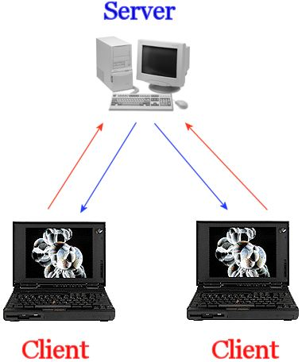

{width="150"
height="150"}\
\
  ---------------
   Introduction
  ---------------

+--------------------------------------------------------------------------+
| Installation\                      |
| \                                                                        |
| Please refer to the [Compiler Setup](compilersetup.html) page, as all    |
| your questions should be answered there. If you have additional problems |
| please refer to the [FAQ](faq.html), <http://www.jenkinssoftware.com>,   |
| or [contact us](mailto:rakkar@jenkinssoftware.com). Advanced users can   |
| jump to the [code tutorial](tutorial.html). Beginners or those wishing   |
| to learn more about RakNet should keep reading.\                         |
| \                                                                        |
| API Description\                                                         |
| \                                                                        |
| RakNet is a game engine solely managing networking and related services. |
| It includes game-level replication, patching, NAT punchthrough, and      |
| voice chat. It allows any application to communicate with other          |
| applications that also uses it, whether that be on the same computer,    |
| over a LAN, or over the internet. Although RakNet can be used for any    |
| networked application, it was developed with a focus on online gaming    |
| and provides extra functionality to facilitate the programming of online |
| games as well as being programmed to address the most common needs of    |
| online games.\                                                           |
| \                                                                        |
| Networking 101\                                                          |
| \                                                                        |
| Game network connections usually fall under two general categories: peer |
| to peer and client/server. Each of these are implemented in a variety of |
| ways and with a variety of protocols. However, RakNet supports any       |
| topology.\                                                               |
| \                                                                        |
| {width="380" height="456"}                          |
| \                                                                        |
| Generally speaking, the fastest computer with the best connection should |
| act as the server, with other computers acting as the clients.\          |
| \                                                                        |
| While there are many types of ways to encode packets, they are all       |
| transmitted as either UDP or TCP packets. TCP packets are good for       |
| sending files, but not so good for games. They are often delayed         |
| (resulting in games with a lot of lag) and arrive as streams rather than |
| packets (so you have to implement your own scheme to separate data). UDP |
| packets are good because they are sent right away and are sent in        |
| packets so you can easily distinguish data. However, the added           |
| flexibility comes with a variety of problems:\                           |
| -   UDP packets are not guaranteed to arrive. You may get all the        |
|     packets you sent, none of them, or some fraction of them.            |
| -   UDP packets are not guaranteed to arrive in any order. This can be a |
|     huge problem when programming games. For example you may get the     |
|     message that a tank was destroyed before you ever got the message    |
|     that that tank had been created!                                     |
| -   UDP packets are guaranteed to arrive with correct data, but have no  |
|     protection from hackers intercepting and changing the data once it   |
|     has arrived.                                                         |
| -   UDP packets do not require a connection to be accepted. This sounds  |
|     like a good thing until you realize that games without protection    |
|     from this would be very easy to hack. For example, if you had a      |
|     message that said "Give such and such invulnerability" a hacker      |
|     could copy that message and send it to the server everytime they     |
|     wanted invulnerability.                                              |
| -   The UDP transport does not provide flow control or aggregation so it |
|     is possible to overrun the recipient and to send data inefficiently. |
+--------------------------------------------------------------------------+

  ---------------------------------------------
   How does RakNet help me with these issues?
  ---------------------------------------------

+--------------------------------------------------------------------------+
| At the lowest level, RakNet's peer to peer class, RakPeerInterface       |
| provides a layer over UDP packets that handle these problems             |
| transparently, allowing the programmer to focus on the game rather than  |
| worrying about the engine.\                                              |
| -   RakNet can automatically resend packets that did not arrive.         |
| -   RakNet can automatically order or sequence packets that arrived out  |
|     of order, and does so efficiently.                                   |
| -   RakNet protects data that is transmitted, and will inform the        |
|     programmer if that data was externally changed.                      |
| -   RakNet provides a fast, simple, connection layer that blocks         |
|     unauthorized transmission.                                           |
| -   RakNet transparently handles network issues such as flow control     |
|     and aggreggation.                                                    |
|                                                                          |
| Of course, RakNet would be not much use if it handled these issues       |
| inefficiently such as by sending a lot of data, locking up with blocking |
| operations, or making it hard to take advantage of these features.       |
| Fortunately, that is not the case.\                                      |
| \                                                                        |
| Unlike some other networking APIs:\                                      |
| -   RakNet adds very few bytes to your data.                             |
| -   RakNet does not incur overhead for features you do not use.          |
| -   RakNet has nearly instantaneous connections and disconnections.      |
| -   RakNet does not assume the internet is reliable. RakNet will         |
|     gracefully handle connection problems rather than block, lock-up,    |
|     or crash.                                                            |
| -   RakNet technology has been successfully used in dozens of games.     |
|     It's been proven to work.                                            |
| -   RakNet is easy to use.                                               |
| -   RakNet is well-documented.  Every header file has every class and    |
|     function documented.  There is a Doxygen manual as well as the HTML  |
|     manual you are looking at.                                           |
+--------------------------------------------------------------------------+

  ----------------------------------
   What else can RakNet do for me?
  ----------------------------------

+--------------------------------------------------------------------------+
| Working at the level of byte streams and packets is bandwidth efficient  |
| and gives you a great deal of control but is time consuming. RakNet      |
| provides many features to make networking easier, including remote       |
| function calls, the BitStream class, and automatic object                |
| synchronization.\                                                        |
| \                                                                        |
| Most games share a common set of functionality, such as setting player   |
| limits, password production, and statistics. RakNet includes all these   |
| features and more.  If your game needs it you should check to make sure  |
| RakNet doesn't have it integrated already.                               |
|                                                                          |
| Lastly, RakNet includes programs and services that work in conjunction   |
| with your game, such as the [master                                      |
| server](http://masterserver2.raknet.com/) or real time voice\            |
| \                                                                        |
| Here is a partial list of things you can do "out of the box."\           |
|                                                                          |
| -   Implement low-bandwidth voice communications.                        |
| -   Use our [master server](http://masterserver2.raknet.com/) for        |
|     players to find games on the internet.                               |
| -   Utilize remote function calls, allowing you to call functions on     |
|     other computers with variable parameters.                            |
| -   Get statistics such as ping, packetloss, bytes sent, bytes received, |
|     packets sent, packets received, and more.                            |
| -   Optional per-packet timestamping so you know with a fair degree of   |
|     accuracy how long ago an action was performed on another system      |
|     despite ping fluctuations.                                           |
|                                                                          |
| Next page: [System Overview](systemoverview.html)                        |
+--------------------------------------------------------------------------+

  -----------
   See Also
  -----------

  ---------------------------------------------------------
  [Index](index.html)\
  [System Overview](systemoverview.html)\
  [Detailed Implementation](detailedimplementation.html)\
  [Tutorial](tutorial.html)\
  [Compiler Setup](compilersetup.html)\
  ---------------------------------------------------------

