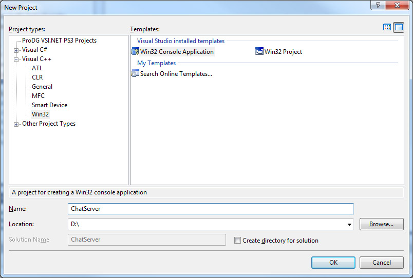
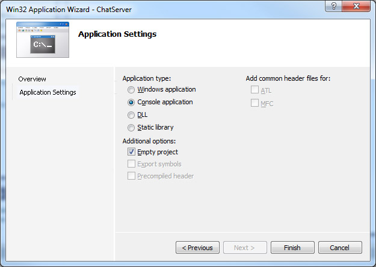
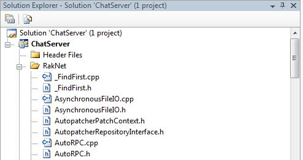
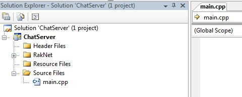
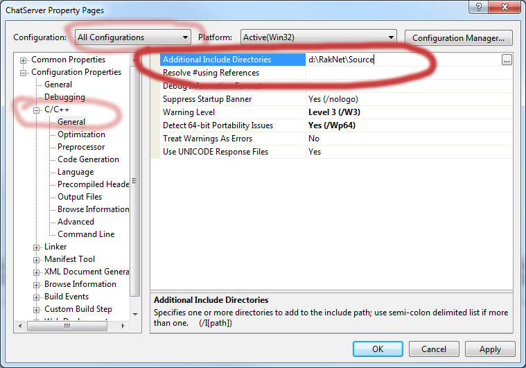
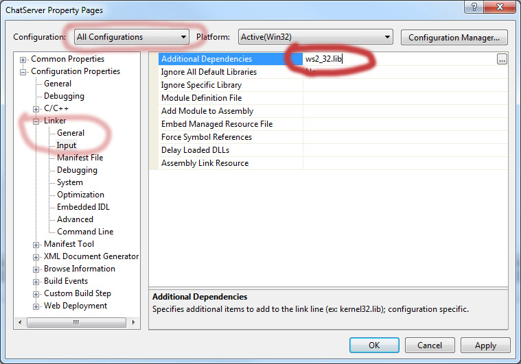
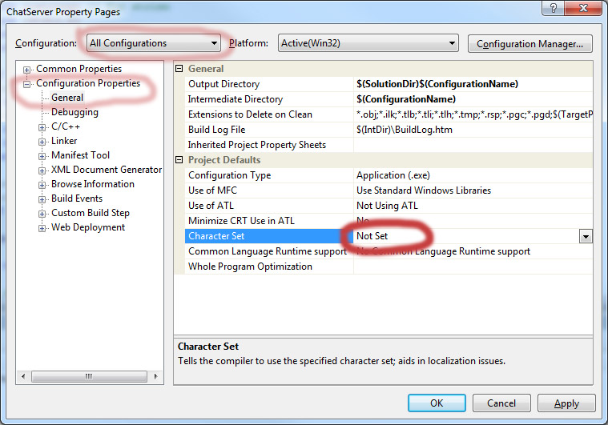

# Tutorial Project setup

 In this tutorial all images and interface references are for Visual 
 Studio 2005, copyrighted by Microsoft. Use the equivalents for your own  
 compiler.
 
 1.  Create a new Win32 Console Project and name it ChatServer
   
  
 2.  Make it a console application, and an empty project. Windows    
application is also acceptable. 
 
    
 3.  Add the RakNet source files to your project. You can do this by 
right clicking on the project name, selecting Add, and then Existing 
Item from the rollout. Navigate to where you downloaded RakNet, 
navigate to the Source directory, hold down left shift, select the   
first file in the list, then click the last file in the list. Then   
press OK.    
   
 
 4.  Add a main file to your project. Do this by right clicking on the    
project name, selecting Add, and then new item. Under Visual C++
select code, then c++ file. Name the file main.cpp. 
 
 
 5.  Since we put files in a directory other than the project, we need to 
include that directory in the include search path so we don't have   
to type out the entire path every time we `#include` something. Do    
this by right clicking the "Chat Server" project name in the    
project tab. Select properties. In the top pane, change the drop
down menu to "All Configurations." Select C/C++ / General /
Additional Include Directories. To that item, add the path to the    
Source directory of your RakNet download, and hit OK.
    
 
 6.  Next, link in ws2\_32.lib, from the same dialog box. 
    
 
 7.  Also change the character set to not set. This is so regular array   
based strings are used, as opposed to unicode or wide character.
    

 8.  You are ready to begin adding code to main.cpp  
  
## Tutorial Code implementation

### Design

  Lets make the chat server as basic as possible to begin with. It will
  have two main modes: server and client. The server will receive a client
  message. The client will send a message on startup. We'll hardcode most
  of the input variables so we don't clutter the code with non-networking
  stuff.

### First compile

  Create your main function. Query the user as to whether they want to run
  a client or server. Create the peer instance, and call Startup with the
  appropriate parameters for a Server or Client. Destroy the peer at the
  end.
  
  Try writing it on your own first. When you are done,
  
  **[Display code sample 1](tutorialsample1.html)**
  
  Hit F7 or the equivalent to build. It should build successfully at this
  point. If it doesn't, refer to the [FAQ](faq.html) which gives many
  reasons for why something won't build and how to fix it. If that doesn't
  answer your question, post a question in the
  [forum](http://www.jenkinssoftware.com/forum).

### Adding functionality
    
 Now that we have a client and server instantiated, we need to know what  
 it can do. The best way to find out is to go to the source:    
 RakPeerInterface.h. It contains all the functions for the class, plus    
 detailed comments on each function. See the comments for the Startup and 
 Connect functions. You should also take a look at    
 SetMaximumIncomingConnections.  

 In the code, after the server was created, add code to start the server. 
 That takes certain parameters - set whatever you wish, based on the 
 description provided in the comments.
    
 Do something similar with the client. After the code where it is    
 created, add code to connect it. It takes an IP - add code to read an    
 IP. For the server port, either put code to read the port, or hardcode   
 the server port you entered above. For the client port, either put code  
 to read it, or put 0 to automatically choose.  
    
 This is all you need to do to start a server or connect a client. To
 determine if the connection was successful, we need to be able to read   
 messages from the network system. In RakPeerInterface.h you'll find a    
 Receive function. This function returns a "Packet" structure, which is   
 defined in RakNetTypes.h. It encapsulates one message and is quite  
 simple. Go look at that now.    
    
 As you can see from the `char *data` member, all packets contain an
 array of bytes. These bytes can be anything you want. The length of the  
 array is indicated by the length and bitSize fields. The convention 
 RakNet uses is the first byte is always an identifier that tells you
 what the rest of the data is. These identifiers are defined in 
 [MessageIdentifiers.h](networkmessages.html). Go look at that now. 
    
 You'll see there are quite a few pre-defined enumerations. You should    
 quickly read the comments on each of them. We only care about the   
 connectivity enumerations for now. So your next programming step is as   
 follows:   
   
 1.  Create a loop for the main body of your program. 
 2.  In that loop, call Receive and store the pointer returned in a  
pointer variable of type Packet.  
 3.  If the packet variable is not 0 (which means no packets to read),    
check the first byte of Packet::data. See which of the connectivity  
related enumerations this byte matches (a switch/case would be  
handy here).  
 4.  Print out the comment that goes along with that enumeration.    
 5.  As specified in the comments, when you are done with the Packet 
pointer deallocate it by passing it to the DeallocatePacket method.  
    
 Try writing it on your own first. When you are done,
 
 **[Display code sample 2](tutorialsample2.html)**   
    
 At this point you should be able to run two instances (In Visual Studio, 
 hit ctrl-F5 twice) and connect to each other. If you cannot connect,
 then refer to the [FAQ](faq.html) or post in the
 [forum](http://www.jenkinssoftware.com/forum).
 
 This is the output from my version of the sample:   
    
**Server output**

    (C)lient or (S)erver? 
    s
    Starting the server.
    A connection is incoming.
    
    
 **Client output**
 
    (C)lient or (S)erver?
    c
    Enter server IP or hit enter for 127.0.0.1
    127.0.0.1
    Starting the client.
    Our connection request has been accepted.
    
 We are now ready to send input.
  
 Your next programming steps are: 
 1.  Add a user defined enumeration to send as the first byte of your
game messages.
 2.  When the client successfully connects, send a string  
using RakString(). Read it on the server, and print it out.
    
 When you are done,
     
 **[Display code sample 3](tutorialsample3.html)**   
    
 The client output should be similar to before. The server output should  
 also print "Hello World"   

    (C)lient or (S)erver? 
    s
    Starting the server.  
    A connection is incoming.  
    Hello World

 See the index for a list of major systems not covered here. For further  
 information on setting up your project, see the next page: [Compiler
 setup](compilersetup.html)  

## See Also

* [Index](index.html)
* [BitStreams](bitstreams.html)
* [Creating Packets](creatingpackets.html)
* [FAQ](faq.html)
* [Network Messages](networkmessages.html)
* [NetworkIDObject.h](networkidobject.html)
* [SystemAddress](systemaddresses.html)
* [Receiving Packets](receivingpackets.html)
* [Remote Procedure calls](remoteprocedurecalls.html)
* [Sending Packets](sendingpackets.html)
